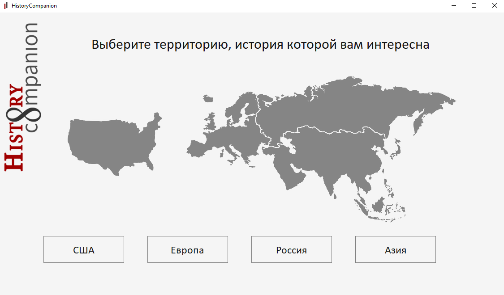

<h1 align="center">HistoryCompanion</h1>

**HistoryCompanion** — это десктопное приложение на Python, предназначенное для помощи в изучении истории. Оно предоставляет удобный интерфейс для поиска исторических событий.

 

___
## 🛠️ Tools
- **Python** — основной язык программирования
- **PyQt5** — для графического интерфейса
- **SQLite** — хранение исторических данных
## Функционал
- **Выбор одной из 4х территорий, доступных для изучения:**
- **По введенной дате пользователь получает событие**
- **События можно добавлять в избранное**
## Цели
Освоение библиотеки PyQt5, а также взаимодействие с базами данных внутри приложения